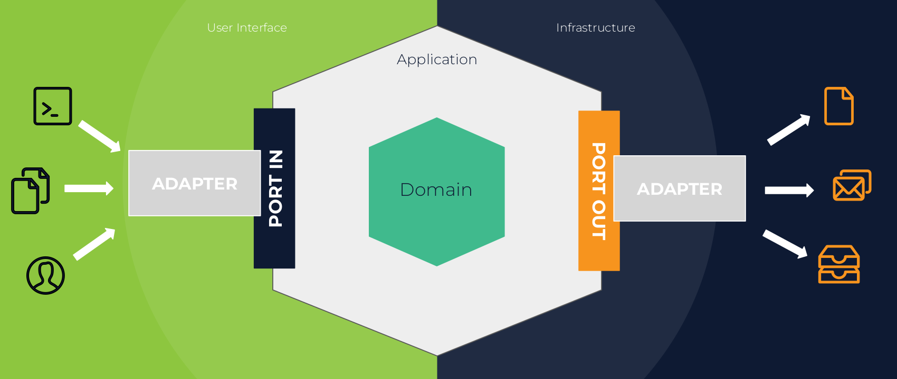
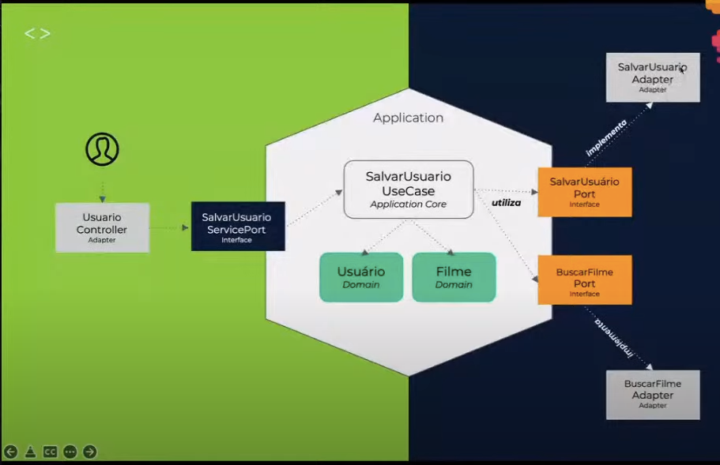

# Hexagonal Architecture Exemplo
Este projeto foi concebido para fins educacionais para entender os conceitos e implementação da arquitetura hexagonal.

## Pré-requisitos
- JDK 11
- Maven
- Docker
- Docker-compose

## Como rodar

Este aplicativo é empacotado como uma guerra que possui o Tomcat 8 incorporado. Nenhuma instalação do Tomcat ou JBoss é necessária. Você o executa usando o ```java -jar``` command.

* Clonar este repositório
* Este projeto depende de um banco de dados, rodar ```docker-compose up``` no diretório raiz do projeto para iniciar o contêiner postgresql.
* Depois que o contêiner estiver em execução, você poderá criar o projeto e executar os testes executando ```mvn clean install```
* Uma vez construído com sucesso, você pode executar o serviço por um destes dois métodos:
```
        java -jar -Dspring.profiles.active=test target/arquitetura-hexagonal-0.0.1-SNAPSHOT.jar
ou
        mvn spring-boot:run -Drun.arguments="spring.profiles.active=test"
```

Depois que o aplicativo for executado, você deverá ver algo como isto

```
2022-10-17 08:03:10.346  INFO 23900 --- [           main] o.s.b.w.embedded.tomcat.TomcatWebServer  : Tomcat started on port(s): 8080 (http) with context path ''
2022-10-17 08:03:10.376  INFO 23900 --- [           main] c.m.a.ArquiteturaHexagonalApplication    : Started ArquiteturaHexagonalApplication in 3.343 seconds (JVM running for 4.055)
```

## Sobre o serviço

O serviço é apenas um serviço REST de programa de TV/filme favorito do usuário. Ele usa um banco de dados postgresql para armazenar os dados e possui integração com a API do OMDB.

Aqui estão alguns endpoints que você pode chamar:

### Crie um usuário associado ao seu filme ou programa de TV favorito
```
POST /users
Accept: application/json
Content-Type: application/json
{
    "name": "Mônica Ribeiro",
    "favoriteMovieTitle": "Friends"
}

RESPONSE: HTTP 201 (Created)
{
    "id": 1,
    "name": "Mônica Ribeiro",
    "favoriteMovie": {
        "imdbID": "tt0108778",
        "title": "Friends",
        "poster": "https://m.media-amazon.com/images/M/MV5BNDVkYjU0MzctMWRmZi00NTkxLTgwZWEtOWVhYjZlYjllYmU4XkEyXkFqcGdeQXVyNTA4NzY1MzY@._V1_SX300.jpg"
    }
}
```

### Encontrar usuário por id
```
POST /users/{id}
Accept: application/json
Content-Type: application/json

RESPONSE: HTTP 200 (OK)
{
    "id": 1,
    "name": "Mônica Ribeiro",
    "favoriteMovie": {
        "imdbID": "tt0108778",
        "title": "Friends",
        "poster": "https://m.media-amazon.com/images/M/MV5BNDVkYjU0MzctMWRmZi00NTkxLTgwZWEtOWVhYjZlYjllYmU4XkEyXkFqcGdeQXVyNTA4NzY1MzY@._V1_SX300.jpg"
    }
}
```

## O que é Arquitetura Hexagonal?

É uma arquitetura proposta por Alistair Cockburn, que inicialmente se chamava Ports And Adapters.

Esta é uma proposta de arquitetura em camadas, assim como outras, de forma a **proteger a lógica de negócios**. A diferença é que Allistar entendeu que não havia muita diferença entre como a interface do usuário e o banco de dados interagiam com o aplicativo, pois ambos eram _itens externos que podiam ser trocados a qualquer momento_.

Com isso, ele propõe **portas**, que são interfaces (aplicando o princípio de inversão de dependência) que nossa lógica de negócios conhecerá para mitigar a dependência direta de fatores externos (interface do usuário, bancos de dados, integrações, filas...). E, o segundo ponto que ele propôs foi a **adaptadores**, que são a implementação dessas portas com as dependências externas.

Uma imagem que representa esse conceito é:






## Como este projeto está organizado?

```
├── src
│   ├── main
│   │   ├── java
│   │   │   └── com
│   │   │       └── exemplo
│   │   │           └── arquiteturahexagonal
│   │   │               ├── adapter
│   │   │               │   ├── inbound
│   │   │               │   │   └── controller
│   │   │               │   │       ├── request
│   │   │               │   │       │   └── CreateUserRequest.java
│   │   │               │   │       ├── response
│   │   │               │   │       │   ├── MovieResponse.java
│   │   │               │   │       │   └── UserResponse.java
│   │   │               │   │       └── UserController.java
│   │   │               │   └── outbound
│   │   │               │       ├── integration
│   │   │               │       │   ├── FindMovieAdapter.java
│   │   │               │       │   ├── OmdbClient.java
│   │   │               │       │   └── OmdbMovieResponse.java
│   │   │               │       └── repository
│   │   │               │           ├── GetUserByIdAdapter.java
│   │   │               │           ├── SaveUserAdapter.java
│   │   │               │           ├── UserEntity.java
│   │   │               │           └── UserRepository.java
│   │   │               ├── ArquiteturaHexagonalApplication.java
│   │   │               ├── config
│   │   │               │   ├── BeanConfig.java
│   │   │               │   └── exception
│   │   │               │       ├── ApiErrorMessage.java
│   │   │               │       ├── CustomExceptionHandler.java
│   │   │               │       └── UserNotFoundException.java
│   │   │               └── domain
│   │   │                   ├── domain
│   │   │                   │   ├── Movie.java
│   │   │                   │   └── User.java
│   │   │                   ├── ports
│   │   │                   │   ├── inbound
│   │   │                   │   │   ├── CreateUserUseCasePort.java
│   │   │                   │   │   └── GetUserByIdUseCasePort.java
│   │   │                   │   └── outbound
│   │   │                   │       ├── FindMovieAdapterPort.java
│   │   │                   │       ├── GetUserByIdAdapterPort.java
│   │   │                   │       └── SaveUserAdapterPort.java
│   │   │                   └── usecase
│   │   │                       ├── CreateUserUseCase.java
│   │   │                       └── GetUserByIdUseCase.java
```

#### Adapters 
Eles são a implementação de suas dependências externas (user interface/inbound and infrastructure/outbound)
- `adapter/inbound`: é aqui que estão todos os nossos controladores.
- `adapter/outbound`: é aqui que estão todas as nossas integrações externas (repositório, integração de API etc).

#### Domain
Aqui temos todas as nossas classes que não possuem nenhuma dependência, incluindo dependências de framework.
- `domain/domain`: é aqui que estão todos os domínios.
- `domain/ports/inbound`: é aqui que estão nossas interfaces que representam nossos casos de uso.
- `domain/ports/outbound`: é aqui que estão nossas interfaces que representam os serviços externos. Observe que aqui não temos nenhuma nomenclatura ligada às tecnologias.
- `domain/usecase`: é aqui que está a implementação dos casos de uso.

## Considerações
Este é um exemplo de como implementar a estrutura da arquitetura hexagonal.

Sua maior preocupação deve ser fazer bom uso dos conceitos de portas e adaptadores, o que está totalmente relacionado com a inversão de dependências. Além disso, é importante respeitar o fato de que seus casos de uso, interfaces (portas) e domínios não devem ter nenhuma dependência externa (inclusive com o framework).

A ideia é que sua regra de negócio esteja totalmente protegida desses fatores externos.


